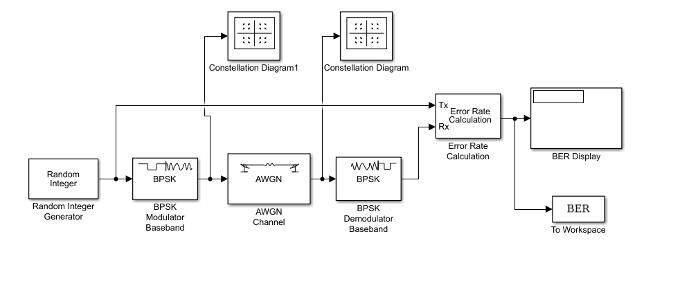
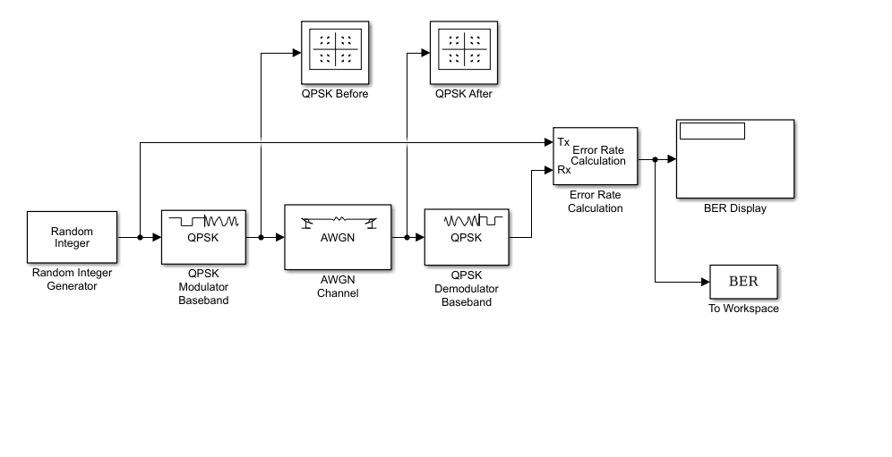
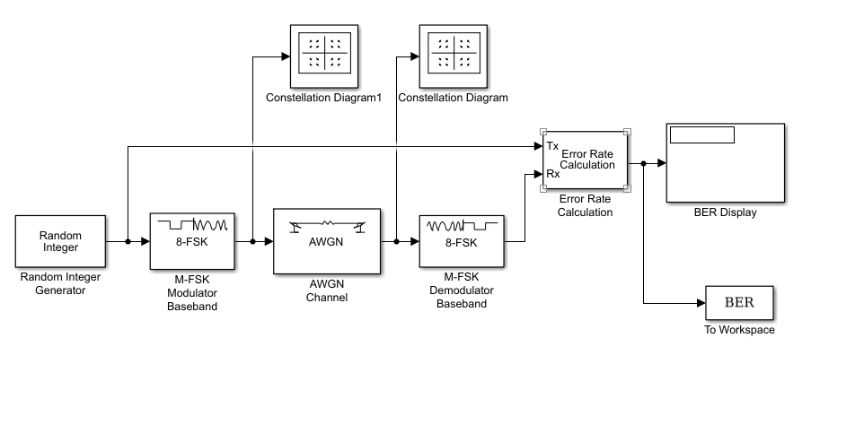
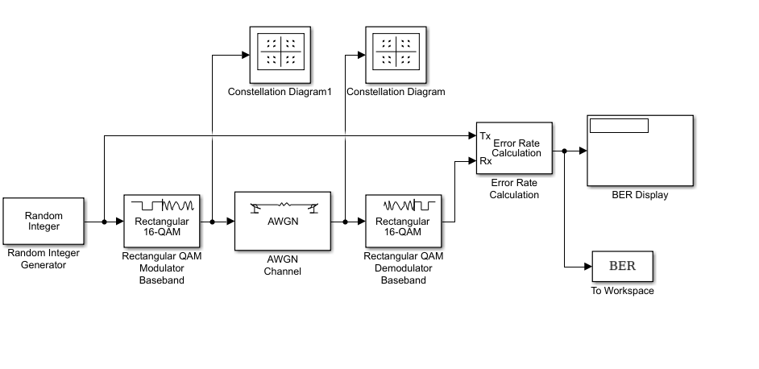
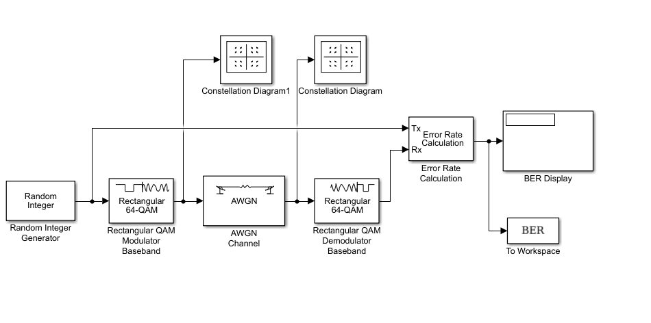

# Ahmed Mohamed Soliman
# Sec: 1, B.N: 9 
# Communications-project

## Simulation Environment
These instructions for all the modulation schemes 
- Open MATLAB, then click on "Simulink", then click on "Open".
- Choose the .slx file you want to open. 
- Open MATLAB command window and write "bertool", Open "Monte Carlo" tab, Choose the .slx file.
- Set BER variable name to "BER".
- Set Eb/N0 range to "-10:.5:10" dB.
- Click run.

Note: Scatter plots are produced at a noise level of 10 dB.
## **Binary Phase-Shift Keying Modulation (BPSK)**
### - Definition 
BPSK is a two phase modulation scheme, where the 0’s and 1’s in a binary message are represented by two different phase states in the carrier signal: θ=0∘ for binary 1 and θ=180∘ for binary 0.

### - Schema

### - Scatter Plot (Before Noise)

### - Scatter Plot (After Noise)

### - BER Plot

## **Quadrature Phase-Shift Keying Modulation (QPSK)**
### - Definition 
QPSK is type of  phase shift keying. Unlike BPSK which is a DSBCS modulation scheme with digital information for the message, QPSK is also a DSBCS modulation scheme but it sends two bits of digital information a time (without the use of another carrier frequency).

### - Schema

### - Scatter Plot (Before Noise)

### - Scatter Plot (After Noise)

### - BER Plot

## **Frequency Shift Keying (FSK)**
### - Definition 
FSK is the digital modulation technique in which the frequency of the carrier signal varies according to the digital signal changes. FSK is a scheme of frequency modulation. The output of a FSK modulated wave is high in frequency for a binary High input and is low in frequency for a binary Low input. The binary 1s and 0s are called Mark and Space frequencies.

### - Schema

### - Scatter Plot (Before Noise)

### - Scatter Plot (After Noise)

### - BER Plot

## **Quadrature Amplitude Modulation (QAM)**
### - Definition
QAM is a modulation scheme that moderates two sinusoidal carriers 90 ° out-of-phase with each other. The components of each carrier are called inphase and quadrature. Both modulated carriers are summed to result in a signal with amplitude and phase modulation. 

### - Schema
* **QAM_16**

### - Scatter Plot (Before Noise)

### - Scatter Plot (After Noise)

### - BER Plot

* **QAM_64**

### - Scatter Plot (Before Noise)

### - Scatter Plot (After Noise)

### - BER Plot

