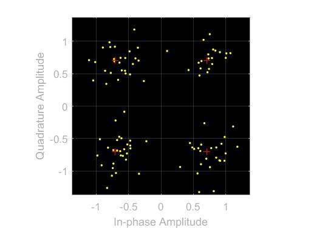

# Ahmed Mohamed Soliman
# Sec: 1, B.N: 9 
# Communications-project

## Simulation Environment
These instructions for all the modulation schemes 
- Open MATLAB, then click on "Simulink", then click on "Open".
- Choose the .slx file you want to open. 
- Open MATLAB command window and write "bertool", Open "Monte Carlo" tab, Choose the .slx file.
- Set BER variable name to "BER".
- Set Eb/N0 range to "-10:.5:10" dB.
- Click run.

Note: Scatter plots are produced at a noise level of 10 dB.
## **Binary Phase-Shift Keying Modulation (BPSK)**
### - Definition 
BPSK is modulation scheme makes the phase of the output signal gets shifted depending upon the input. It works on binary inputs, thus the output phase different is 180 degree.

### - Schema

### - Scatter Plot (Before Noise)

### - Scatter Plot (After Noise)

### - BER Plot

## **Quadrature Phase-Shift Keying Modulation (QPSK)**
### - Definition 
QPSK is modulation scheme makes the phase of the output signal gets shifted depending upon the input. Exactly like BPSK but the input is 2-bits (4 values), thus the output phase will be shifted (0, 90, 180, or 270) degree.

### - Schema

### - Scatter Plot (Before Noise)

### - Scatter Plot (After Noise)

### - BER Plot

## **Frequency Shift Keying (FSK)**
### - Definition 
FSK is modulation scheme makes the frequency of the output signal will be either high or low, depending upon the input data applied. The simplest FSK is binary FSK which I used here.

### - Schema

### - Scatter Plot (Before Noise)

### - Scatter Plot (After Noise)

### - BER Plot

## **Quadrature Amplitude Modulation (QAM)**
### - Definition
QAM is modulation scheme makes the output signal get both ampltiude and phase shifting into a single channel, thereby it uses the bandwidth efficiently. It especially in wireless applications. Depending on number of symbols, another phases and amplitudes appear/disappear. 

### - Schema
* **QAM_16**

### - Scatter Plot (Before Noise)

### - Scatter Plot (After Noise)

### - BER Plot

* **QAM_64**

### - Transmitter Scatter Plots (Before Noise)

### - Receiver Scatter Plots (After Noise)

### - BER Plot

